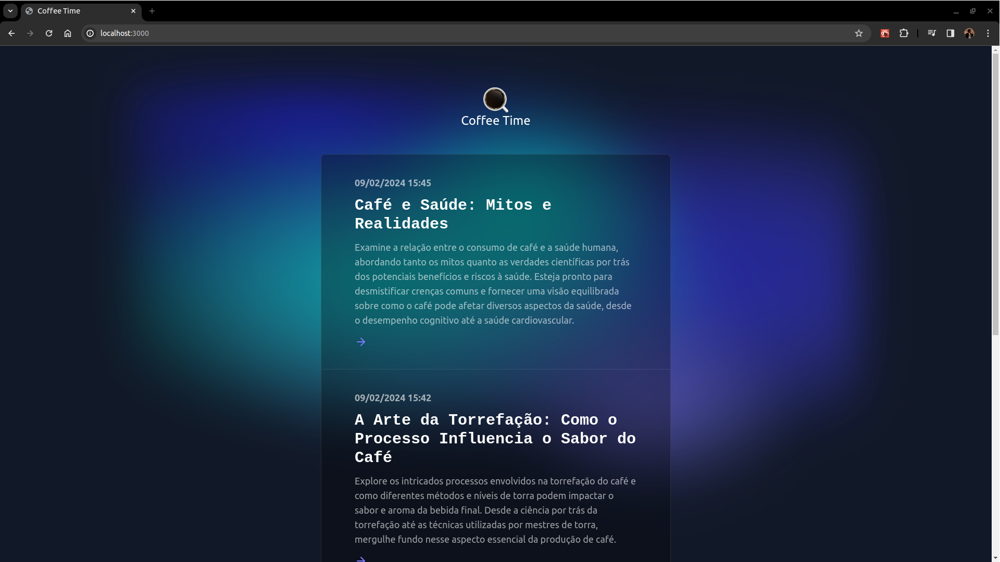
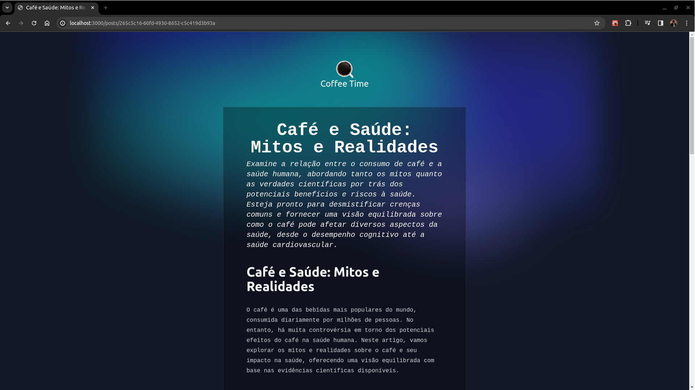
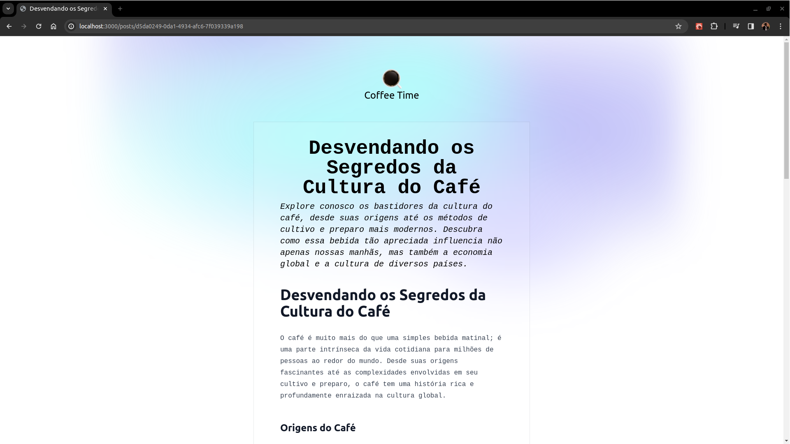

# Projeto: Coffee Time 

Este projeto foi desenvolvido como parte do desafio **Criando o Seu Blog Pessoal Com Next.js - Digital Innovation One**.





## Descrição
O projeto foi gerado a partir de [netlify-templates/nextjs-blog-theme](https://github.com/netlify-templates/nextjs-blog-theme). O blog consome uma api do Supabase que contém os dados das publicações.

## Funcionalidades
- Lista algumas informações sobre as publicações;
- Visualiza todas as informações de uma publicação;

## Como usar

1. Clone o repositório para o seu ambiente local:

   ```bash
   git clone https://github.com/FavaroDarkStar/coffee-time-next-blog.git
   ``` 
 
2. Acesse o diretório do projeto:

   ```bash
   cd coffee-time-next-blog
   ```

3. Acesse a pasta './services' e crie um arquivo 'key.js' seguindo o codigo:
   ```code
   export const apiKey = '';
   export const authorization = '';
   ```


4. Instale as dependências necessárias:

   ```bash
   yarn install
   ```

5. Execute o aplicativo:

   ```bash
   yarn run dev
   ```


7. Abra o navegador e acesse [http://localhost:3000](http://localhost:3000) para visualizar o aplicativo em ação.

